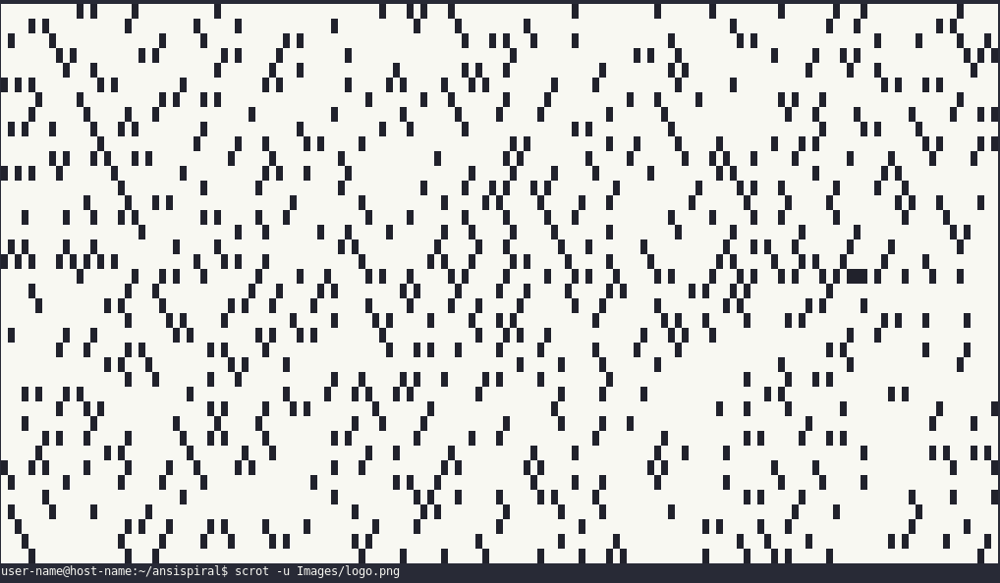

# AnsiSpiral

AnsiSpiral is a Simple Unix terminal prime spiral viewer written in Python that utilizes ansi escape sequences to render the prime spiral into the terminal.

## Requirements

- Unix like system
- Python >= 3.9
- Support to ansi escape sequences and [24bit color](https://en.wikipedia.org/wiki/Color_depth)

## Arguments
- `-h, 	--help        → show this help message and exit`
- `-v, 	--version     → show program's version number and exit`
- `-r, 	--rows        → rows of NxM prime spiral`
- `-c, 	--columns     → columns of NxM prime spiral`
- `-f, 	--fill        → NxM prime spiral size the same as terminal screen`
- `-dw, --downward    → NxM prime spiral numbers won't be downward`
- `-sn, --shownum     → NxM prime spiral without graphics

## Made by [Sivefunc](https://gitlab.com/sivefunc)
## Licensed under [GPLv3](LICENSE)
